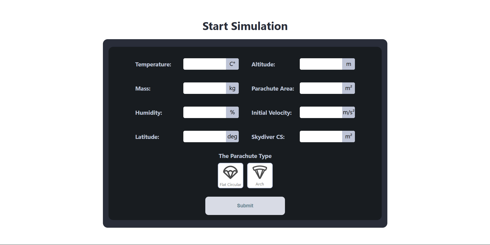

# 3D Skydiving Physics Simulation

## I. Introduction
The **3D Skydiving Physics Simulation** is a web-based interactive experience built with **Three.js** that realistically simulates freefall dynamics. The simulation accounts for crucial real-world physics, including:
- **Coriolis Force**
- **Wind Influence**
- **Temperature & Humidity Effects**
- **Parachute Deployment & Drag Impact**

This project provides an immersive and educational visualization of skydiving dynamics, helping users understand the forces at play during a skydive.

I made this project back in 2023, third year of university.

---

## II. Features
- **Realistic Freefall Physics**: Accurately models gravity, drag, and atmospheric effects.
- **Customizable Parameters**: Users can set environmental and physical properties to see their impact.
- **Parachute Deployment**: Trigger parachute deployment in real-time.
- **Force Visualization**: See drag, gravity, and wind forces acting on the skydiver.
- **Comprehensive Data Panel**: Monitors real-time changes in skydiving metrics.
- **3D Interactive Environment**: Powered by **Three.js** for smooth rendering.
- **Approximating the Transition between free fall and parachute deployment**: by using interpolation with the sigmoid function.

---

## III. Input Parameters
Users can modify the following parameters before the simulation starts:

| Parameter          | Unit       | Description |
|--------------------|-----------|-------------|
| **Temperature**   | °C        | Affects air density and drag force. |
| **Altitude**      | m         | Initial jump height above sea level. |
| **Mass**         | kg        | Skydiver's total mass. |
| **Parachute Area** | m²       | Effective cross-sectional area when parachute is deployed. |
| **Humidity**      | %         | Affects air density and drag. |
| **Initial Velocity** | m/s²   | Speed at which the skydiver exits the aircraft. |
| **Latitude**      | deg       | Determines Coriolis force magnitude. |
| **Skydiver CS**   | m²        | Cross-sectional area of the skydiver in freefall. |
| **Parachute Type** | N/A      | Visual choice, does not affect physics. |

---

## IV. Assumptions
To simplify calculations while maintaining realistic physics, the following assumptions are made:
1. **Linear Wind Model**: Wind blows at a constant velocity throughout the descent.
2. **Point Mass Approximation**: The skydiver is modeled as a single mass with an effective cross-sectional area.
3. **Simplified Parachute Physics**: The parachute only modifies cross-sectional area; canopy pressure and complex aerodynamics are not modeled.

---

## V. UI Elements
### **Data Panel**
The UI features a real-time **data panel** displaying:

| Metric             | Unit     |
|--------------------|---------|
| **Weight**        | N       |
| **Drag Force**    | N       |
| **Time Elapsed**  | s       |
| **Acceleration**  | m/s²    |
| **Velocity**      | m/s     |
| **Altitude**      | m       |
| **Air Density**   | kg/m³   |
| **Deflection**    | m       |
| **Wind Drift**    | m       |
| **Cross-Sectional Area** | m² |

### **Additional UI Features**
- **3D Force Visualization**: Displays real-time vectors for forces acting on the skydiver.
- **Compass**: Shows wind direction and heading.
- **Parachute Deployment**: Press `T` to deploy the parachute during descent.

---

## VI. Controls
- **Mouse & Keyboard**: Rotate and navigate the 3D view.
- **T Key**: Deploy parachute.

---

## VII. Installation & Usage
1. **Clone the repository**:
   ```sh
   git clone https://github.com/GhassanJar3850/3D-Skydiving-Physics-Simulation.git
   cd 3D-Skydiving-Physics-Simulation
   ```
2. **Install dependencies**:
   ```sh
   npm install
   ```
3. **Run the local server**:
   ```sh
   npm run dev
   ```

---

## VIII. Future Improvements
- Implement **canopy aerodynamics** for more realistic parachute behavior.
- Add **turbulence models** for wind variation.
- Introduce **VR support** for an immersive experience.

---

## IX. Screenshots
### Simulation Parameters View


### UI Elements

<div align="center">
  <div style="display: flex; justify-content: center; align-items: center;">
    <div style="text-align: center; margin: 0 50px;">
      
      <p>Compass</p>
    </div>
    <div style="text-align: center; margin: 0 50px;">
      
      <p>Forces Visualization</p>
    </div>
  </div>
</div>

### Simulation


---

## X. Contributors
Any contribution is welcome, Feel free to fork the repo and submit pull requests.

---

## 📜 License
This project is licensed under the **MIT License**.

